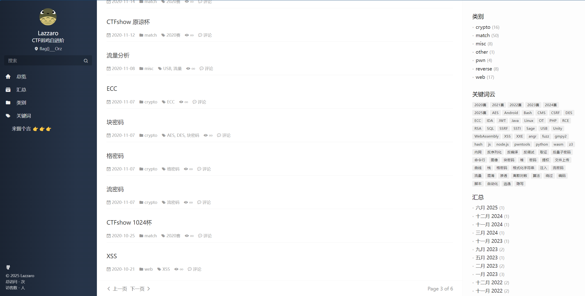

title: 大杂烩
speaker: Misay
css: 
    - https://fonts.googleapis.com/css2?family=Ubuntu:wght@400;600&family=Source+Code+Pro&family=JetBrains+Mono:ital,wght@0,300;0,400;0,600;0,700;1,400;1,700
    - https://gcore.jsdelivr.net/npm/lxgw-wenkai-webfont@1.1.0/style.css
    - https://gcore.jsdelivr.net/npm/lxgw-wenkai-screen-webfont@1.1.0/style.css

plugins:
    - echarts

<slide class="bg-light-blue aligncenter" image="https://source.unsplash.com/C1HhAQrbykQ/ .dark">

# 大杂烩 {.text-landing.text-shadow}

By Misay {.text-intro}

[Repo](https://github.com/zt2misay2){.button}

<slide :class="size-60">
:::
# 迈入学校的这一年，我们学到了什么？ {.text-shadow}
---

<slide :class="size-60">
## 高数、线代、大物等等基础课
---
## 数字逻辑，数据结构，编程语言
---
## 后续的计算机组成，网络，操作系统
---
<slide :class="size-70">
# 它们可能有用，但它们有用好像有点不太可能
---
<slide :class="size-70">
:::{.content-center}
># 我又该学什么？
># 我去哪里学？
># 我该怎么学？

<slide :class="size-70">
# 不只是课堂内，在互联网上你能找到所有你想学的

<slide :class="size-70">
基本体系知识--[CSDIY](https://csdiy.wiki/)
---


<slide :class="size-70">
竞赛实战--各路师傅的博客（以[Lazzzaro](https://lazzzaro.github.io/)师傅的为例）
---


<slide :class="size-70">
还有学长学姐维护的资料--[OpenWHU](https://github.com/openwhu/OpenWHU)
---

#### 不妨将你小学期学到的Git知识派上用场，来尝试一次开源~

<slide :class="size-70">
# 学进去了内容，该如何记录自己的理解呢？
---
<slide :class="size-70">
# 不妨去试试Markdown
---
# 它和Word基本没有区别，甚至具备更简单的排版
---
##  并且能方便的适配各种文件格式，也能很好的写入代码
<slide :class="size-50">
# 常用软件
---

- ### Typora，经典流行，但付费
    - [typora.io](https://typora.io/)
    - 助教应该发了压缩包，破解方法大家可以尝试自行寻找
- ### VSCode，自带预览，可以通过插件达到更好效果
    - [Markdown All in One](https://marketplace.visualstudio.com/items?itemName=yzhang.markdown-all-in-one)
    - [Markdown Preview Enhanced](https://marketplace.visualstudio.com/items?itemName=shd101wyy.markdown-preview-enhanced)
- ### notion、幕布、飞书、语雀等笔记软件
- ### Obsidian，一款免费，而且玩法多样的笔记软件
	- [Download - Obsidian](https://obsidian.md/download)

<slide :class="size-60 aligncenter">

# 语法讲解

---

<slide :class="size-60">

:::{.content-left}

# 标题

---

- 井号 # 开头，后接内容
- 井号与标题间至少一个空格
- 只有 1～6 级标题，7 及以上不会变成标题格式
- 转为 html 利用 h1 ~ h6 tag
- 内容后面可以接任意多 # 来 ”闭合“
- 可以跨过某一级，但请明确好层级关系

:::

:::{.content-right}
```markdown
# 一级标题
## 二级标题
### 三级标题
#### 四级标题
##### 五级标题
###### 六级标题
```
```html
<h1>一级标题</h1>
<h2>二级标题</h2>
<h3>三级标题</h3>
<h4>四级标题</h4>
<h5>五级标题</h5>
<h6>六级标题</h6>
```

<slide :class="size-60">

:::{.content-left}

# 引言

---

- 一个 > 加一个空格后接内容
- 内部可以嵌套使用 markdown 语法
    - 可以嵌套任意多层引言
- 连续的 > 行属于同一个引言块
- 需要一个空行来退出环境
- 软件里一般使用一次 enter 退出一层

:::

:::{.content-right}
```markdown
> ## Quote
> 第二行
> > 第二层
> 
> 回到第一层

退出引言
```

<slide :class="size-60">

:::{.content-left}

# 无序列表

---

- `- + *` 后接一个空格然后接内容
- 同一个层级的符号要相同
- 如果一个项中要包含内容，需要换一行然后加一次缩进
- 嵌套列表直接缩进一次即可

:::

:::{.content-right}
```markdown
- node 1
- node 2

  content in node 2
- node 3

* 第一层
    + 第二层
        * 第三层
    + 第二层
* 第一层
```

<slide :class="size-60">

:::{.content-left}

# 有序列表

---

- 数字加点 后接空格 再接内容
    - 也可以数字加 ) 后接空格 再接内容
- 标准的 md 完全无视数字内容，所有有序列表都从 1 开始计数
- 但一般软件都会处理起始数字
- 有序列表可以和无序列表互相嵌套

:::

:::{.content-right}
```markdown
1. node 1
2. node 2
4. node 3
1. node 4

1. 有序 
    - 嵌套无序
    - 嵌套无序
2. 有序
```

<slide :class="size-60">

:::{.content-left}

# 分割线

---

- 使用 `* - _` 中任意一个字符重复至少三次
- 可以有空格分隔，甚至组织成不同样式
- 被转换为 html 中的 \<hr/>
- 分割线上下最好都加空行
- 特别记住 - 分割线上方不要有文字（Setext 标题）

:::

:::{.content-right}
```text
***

---

___

* * *
_  __  _  __

----------------
```

<slide :class="size-60">

:::{.content-left}

# 代码块

---

- 空行加一个缩进创建一个代码块
- 被转为 html 中 \<pre>\<code>...\</code>\</pre>
- 内部被原样展现
- 软件不会进行代码高亮

:::

:::{.content-right}
```markdown
code block:

    print("hello world")
    # line 2

out
```

<slide :class="size-60">

:::{.content-left}

# 代码块

---

- 使用三个或以上 ` 或 ~ 围起来构成代码块
- ` 或 ~ 后面可以加语言名称
    - 带有高亮支持的软件会对其进行高亮显示
    - 不加（或加 text）不进行高亮

:::

:::{.content-right}
~~~markdown
```c
#include <stdio.h>

int main() {
    printf("hello world\n");
    return 0;
}
```
~~~

<slide :class="size-60">

:::{.content-left}

# 行内标记

---

- 格式见右侧，* 和 _ 等效
- 下划线无 markdown 语法，可以直接使用 html 的 \<u> tag 来实现
- 行内标记都可以互相嵌套
    - 也可以嵌套在其它块中
    - 行内代码中不行
- 最好在标记左右均加空格
- 文字中使用 * 建议加上 \ 转义

:::

:::{.content-right}
```markdown
*斜体* _也是斜体_ \*这不是斜体\*
**粗体** __也是粗体__
***粗斜体*** ___也是粗斜体___
`行内代码`
~~删除线~~
<u>下划线</u>
```
```html
<em>斜体</em>
<strong>粗体</strong>
<code>行内代码</code>
<del>删除线</del>
```

<slide :class="size-60">

:::{.content-left}

# 图片

---

- 感叹号-方括号-圆括号结合的形式
- 图片名可以省略
- 位置可以是链接，也可以是本地文件路径
- md 语法插入图片无法调大小，使用 html img 的 style 可以调节
- 软件一般可以帮你保存图片到某一目录
- 记住图片不会嵌入 md 文件中，要交给别人 md 文件的话请附带上所有素材文件

:::

:::{.content-right}
```markdown


```

<slide :class="size-60">

:::{.content-left}

# 链接

---

- 方括号-圆括号组合
- 文字是要显示的内容，链接附加在其上
- 文字中可以嵌套行内标记格式

:::

:::{.content-right}
```markdown
[文字](链接)
```
```html
<a href="链接">文字</a>
```

<slide :class="size-50">

# 内连 HTML

---

- markdown 中一般可以直接使用 html 语法和 css 样式
- 解析器会原封不动的保留 html 内容
- 文本中使用 \<tag\> 这样的字样需要用 \ 转义
- GitHub（GFM）仅支持少量 html，且不支持 css 样式
- html 语法不赘述

<slide :class="size-60">

:::{.content-left}

# 表格

---

- 不在标准中，但一般这样使用
- 每个单元格的内容用 | 分开
    - 内容中使用 | 要用 \ 转义
- 第二行一定要有，规定整列对齐方式
    - `|--|` 或 `|:--|` 左对齐
    - `|--:|` 右对齐
    - `|:--:|` 居中对齐
    - `-` 的个数随意
- 仅可以处理简单表格，复杂的用 html 插入
- 推荐 [tablesgenerator.com](https://www.tablesgenerator.com/)

:::

:::{.content-right}
```markdown
|表头|表头|表头|
|:--|:--:|--:|
|居左|居中|居右|
|...|...|...|
```
|表头|表头|表头|
|:--|:--:|--:|
|居左|居中|居右|
|...|...|...|

<slide :class="size-60">
 #  甚至这个ppt就是用markdown写的，不过要使用[nodeppt](https://github.com/rrrene/nodePPT)来渲染
---
<slide :class="size-60">
# 除开markdown之外，还有一些小工具你可能用得到
<slide :class="size-60">
- ## 压缩  [7z](https://sparanoid.com/lab/7z/)
- ## 文件管理工具
	- ### 卸载 [geek](https://geekuninstaller.com/download)
	- ### 文件搜索 [everything](https://www.voidtools.com/zh-cn/downloads/)
	- ### 磁盘分区管理 [WizTree](https://www.diskanalyzer.com/download)
	- ### 电子书格式转换与阅读 [Calibre](https://calibre-ebook.com/zh_CN/download)

<slide :class="size-80">
# Q&A {.text-landing}

<slide :class="size-80">
## 联系我 
